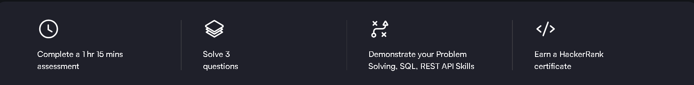
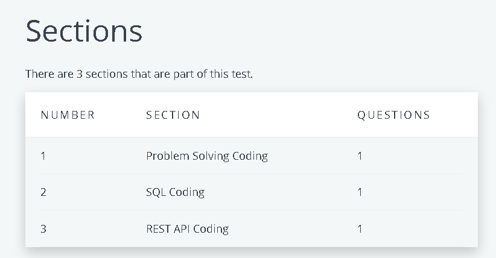

# 💻 Software Engineer – HackerRank Certification

This repository contains notes, exercises, practical files, and the official certificate for the **HackerRank Software Engineer Certification** exam.

---

## 📜 Certificate

- 🎓 [HackerRank Software Engineer – Verified Certification](./cert/certificate-ethical-hacking-henryharvin.pdf)

---

## 📘 Notes

| File                         | Description |
|------------------------------|-------------|
| [`object-oriented-design.md`](./notes/object-oriented-design.md) | Principles of OOP, design patterns |
| [`api-design-principles.md`](./notes/api-design-principles.md)   | REST, endpoints, pagination, versioning |
| [`error-handling.md`](./notes/error-handling.md)                 | Strategies for graceful error recovery |
| [`testing-methodologies.md`](./notes/testing-methodologies.md)   | Unit, integration, E2E, mocking |
| [`software-testing.md`](./notes/software-testing.md)             | Advanced testing best practices |

---

## 🛠️ Practicals

> These files simulate real-world software engineering problems from the HackerRank certification challenge.

| File                                 | Description                             |
|--------------------------------------|-----------------------------------------|
| [`relative_pay.sql`](./practicals/relative_pay.sql)         | SQL logic to calculate relative pay     |
| [`maximizing_the_final_element.py`](./practicals/maximizing_the_final_element.py) | Python script for algorithm challenge   |
| [`REST_API_Products_in_Range.py`](./practicals/REST_API_Products_in_Range.py)     | REST API with product filtering logic   |

---

## 📸 Course Screenshots

| Description              | Screenshot |
|--------------------------|------------|
| 🧭 Certification Layout   |  |
| 📚 Section Breakdown      |  |

---

## ✅ Course Review

The **HackerRank Software Engineer Certification** provides a solid technical assessment on core backend and algorithmic challenges.

### ✅ What I Liked:

- Covers multiple domains: SQL, OOP, APIs, testing, algorithms  
- Realistic questions that mirror real-world work  
- Immediate certificate upon passing

### 🔧 What Could Be Improved:

- No retake options after failure  
- Could benefit from more frontend-based challenges

---

## 📌 Notes

- All problems were solved in local environment before being submitted
- Certificate and challenge from: [HackerRank Certifications](https://www.hackerrank.com/skills-directory)

---

## ✍️ Author

**Thành Danh** – Pentester & Cybersecurity Research  

- GitHub: [@ngvtdanhh](https://github.com/ngvtdanhh)  
- Email: ngvu.thdanh@gmail.com

---

## 📄 License

This project is licensed under the terms of the **GNU AGPL v3.0**.  
See [`LICENSE`](./LICENSE) for full details.

© 2025 ngvtdanhh. All rights reserved.
